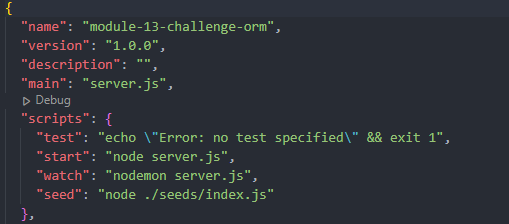

  

  # E-Commerce Backend DB

  ## Table of Contents
  1. [Description](#Description)
  2. [Instructions](#Instructions)
  3. [Usage](#Usage)
  4. [Contributing](#Contributing)
  5. [Tests](#Tests)
  6. [Questions](#Questions)

  ## <a id="Description">Description</a>
  Enter product information for an e-commerce website that will be entered into a database.  Products are associated with product ID and Tags so relational mapping can occur

  ## <a id="Instructions">Instructions</a>
  Run the following commands to deploy the application.  
  Install the following packages by running the commands int he terminal:
  ```
  npm init -y
  npm i express mysql2 sequelize
  npm i dotenv --save
  ```
  
  To open the database, run mysql and login in with your user information:
  ```
  mysql -u <username> -p
  password: <user password>
  source develop/db/schema.sql
  quit
  ```
  **Username** and **password** can be stored by creating .env file and associating Usernam and Password to variables *DB_USER* and *DB_PW*.  The database name can be stored in the *DB_NAME* variable.

  Seed the database:
  ```
  npm run seed
  ```
  Start the server:
  ```
  node develop/server
  ```

  ## <a id="Usage">Usage</a>
  The user can **View**, **Add**, **Update** and **Delete** data from the database through a server application like Insomnia through **GET**, **POST**, **PUT** and **DELETE**, respectively.

  ADD IMAGES/GIF

  ## Contributing
  Fork repo and contact me to be added to the project.

  ## <a id="Tests">Tests</a>
  **Troubleshooting Tips**
  - Confirm the database is connected via the *mysql* command above before staring the server.
  - When executing the *npm run seed* command, first confirm the filepath in the *package.json* file has the correct filepath to the directory containg the seed index.js file.

  

  ## <a id="Questions">Questions</a>
  Github: [cpaschall](https://github.com/cpaschall)
  <br>
  Email: cpaschall216@gmail.com

  ---

  [License: Apache 2.0](https://opensource.org/licenses/Apache-2.0)
 
  